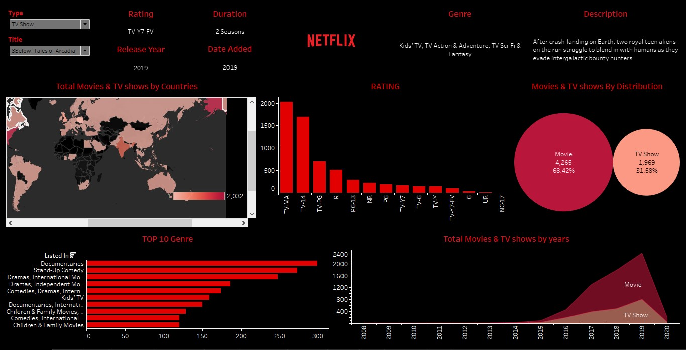

# 📊 Netflix Visualization Project (Tableau)

This project showcases interactive data visualizations of Netflix content using **Tableau**. The goal is to uncover insights into Netflix's content catalog, such as trends by genre, release year, country, and more, to better understand how Netflix's library has evolved over time.

---

## 📌 Project Overview

Netflix has become a global leader in streaming entertainment. This dashboard project explores:

- Content distribution by type (Movie vs. TV Show)
- Trends in release years
- Genre popularity
- Country-wise content production/Watch Per Id
- Ratings and duration breakdown
- Temporal trends (e.g., what years had the most releases)

All visualizations were built using **Tableau Desktop** based on a publicly available dataset.

---

## 📊 Tableau Dashboard




### Dashboard Highlights:
- **Interactive Filters** for country, content type, and years.
- **Time Series Charts** for release trends.
- **Bar Charts & Maps** showing top-producing countries and most common genres.

---

## 🧾 Dataset

- **Source**: [Netflix Titles Dataset - Kaggle](https://www.kaggle.com/datasets/shivamb/netflix-shows)
- **Fields Included**:
  - \`title\`, \`type\`, \`director\`, \`cast\`, \`country\`, \`date_added\`, \`release_year\`, \`rating\`, \`duration\`, \`listed_in\`, \`description\`

---

## 🛠 Tools Used

- **Tableau Desktop**
- **Microsoft Excel / Google Sheets** (for minor cleaning)
- **Kaggle Dataset** (for data source)

---

## 🚀 Getting Started

To explore the dashboard locally:
1. Clone the repo:
   ```bash
   git clone https://github.com/LinguaByte1111/netflix-visualization-project-Tableau/Netflix_Dashboard.twb
   ```
2. Open the \`.twbx\` file in **Tableau Desktop**.
3. Make sure \`netflix_titles.csv\` is available in the same folder for data linkage.


---

⭐ If you found this helpful, feel free to star the repo and share your feedback!
EOF

cd netflix-visualization-project && git init && git add . && git commit -m "Initial commit: Added README and folder structure"
